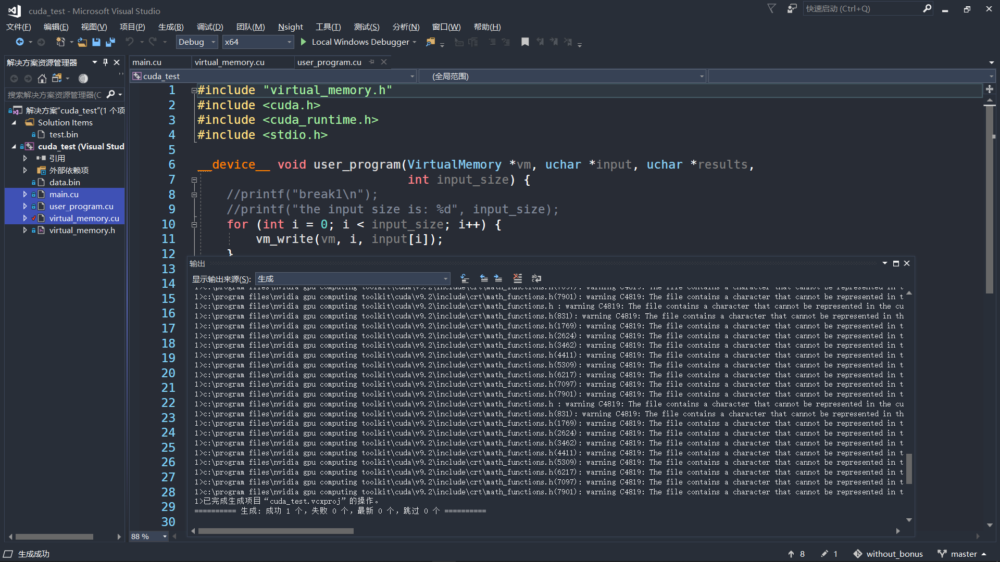
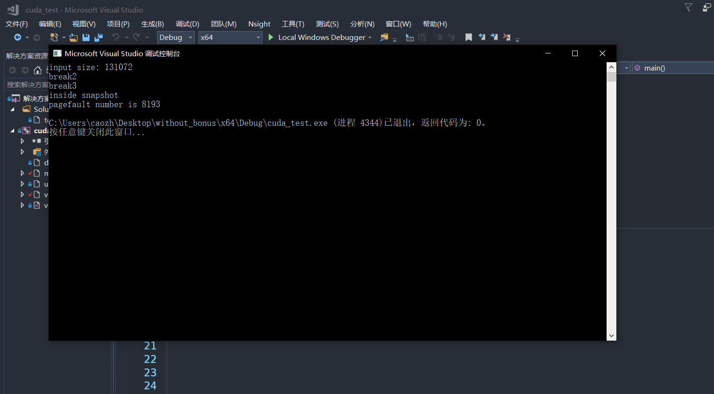
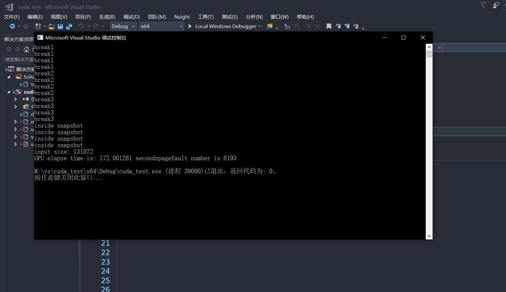
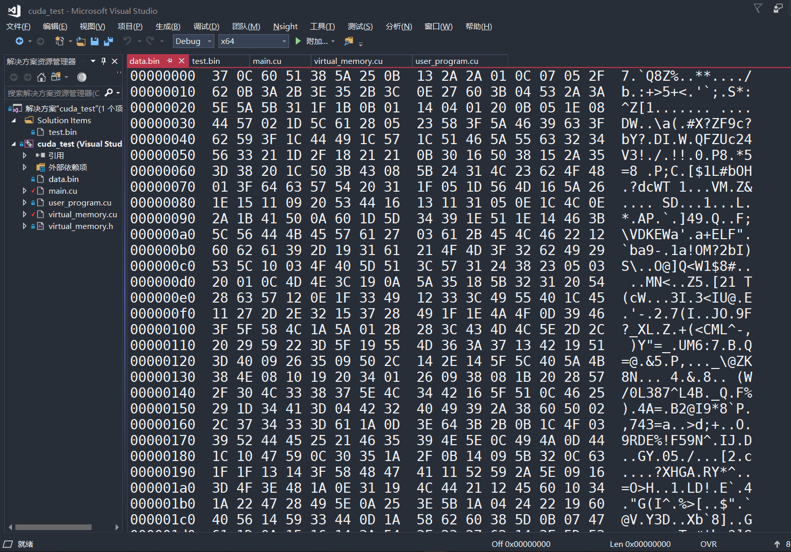
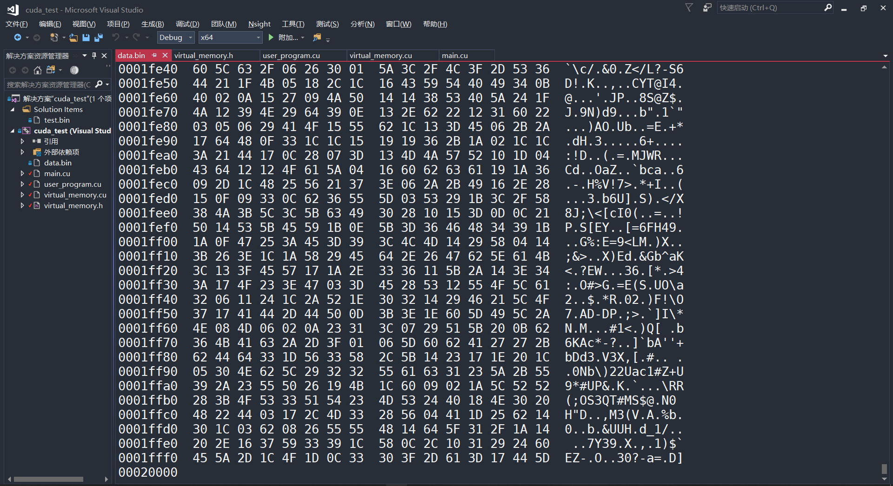
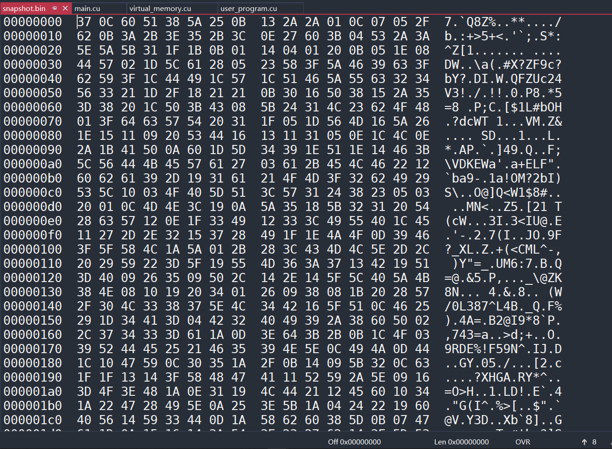
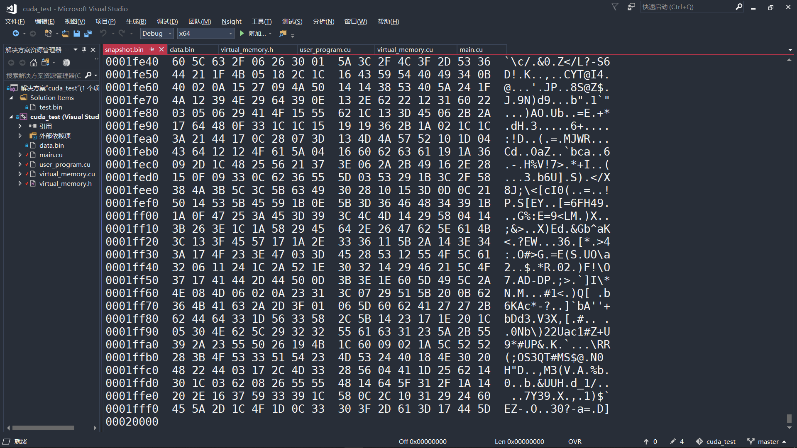

# __CSC3150 Assignment 3__
曹正家 117010008

## 0. Environment and Bonus status
Environment: 
1. OS: Windows10
2. CUDA version: CUDA 9.2 v9.2.148
3. Visual Studio version: VS2017 community
4. VS solution version: VS2015 CUDA solution
5. GPU model: Nvidia GeForce GTX 1050

* NOTE: At least on my computer, the single thread version of the program runs EXTREMELY SLOW. It can even possibly take around 9 - 10 minutes for the execution to complete. However, choosing the multi-threading one would be a lot faster. 

I have finished the bonus part, thus have included two version of the files in the folder (one without bonus section and the other with the bonus section).

## 1. Design of the program
This program is to design a virtual memory that can perform virtual memory's read/write functionalities, and a snapshot function for giving an output file containing the necessary information of the contents in the VM.

To implement the VM, I have used the Inverted pagetable method and the LRU (least recently used) page replacement method.

The fundamental flow of the program is that the whole memory writing and reading stage has been partitioned into 4 large sections.

The first and second sections are in the `vm_write` function, it will take a virtual address and write it into the physical memory system. When the physical memory has been used up and the system is still writing new pages, a swap process will be performed. Note that during writing, there is an initializing stage where only page_fault signal is raised without triggering the swap process. This is because that at this time the buffer (physical memory) is actually empty.

And then rest two sections are `vm_read` and `vm_snapshot` functions respectively. The more details of this part will be discussed further in the subsequent sections.

The detailed implementations are shown as follows :

### global variables
```c++
/* global variables */
#define NUM_THREADS (1<<2)
// the number of threads used in the bonus section. The program is executed with 4 threads in parallel 
```
### Major functions and their designs: 

There are 3 critical functions in this program: `vm_read`, `vm_write` and `vm_snapshot`. To support their execution, I have also added some functions that was originally not in the template file. They are: 

* `__device__ int vm_swap(int phyPage, int virtPage, VirtualMemory* vm)` 
* This function is used for performing the page swap functionalities used during the execution of `vm_read` and `vm_write` functions.The function is used when the pagetable is full, which means that the physical memory (buffer) is full, and we need to perform swap to swap a page out of the physical memory and store it inside the virtual memory (storage). Moreover, the function will ask for a virtualPage number for it to swap a page from the virtual memory into the physical memory. The function will find the least recently used page and its virtual address. Then it will write the content of this page bit by bit into the storage and read the content of the desired virtual address the same way from the storage.

* `__device__ u32 leastUsed(VirtualMemory* vm)`
* This function takes basically no input, and it will iteratively go throught all the used ranks for the elements in the physical memory and try to find the number with the smallest rank. This means that the element with this index is the element that has not been accessed in the physical memory for the longest time. It will pass this 'index' as a return value. The implementation of the function is to loop over the storage for LRU rankings and find the smallest index.

* `__device__ int getPhyAddr(int addr, VirtualMemory* vm) `
* This function will take in the virtual address as a parameter. The return value will either be an physical address of this page in the physical memory or a number `0xFFFFFFFF` representing that the page associated with this virtual address is not yet inside the physical memory. It must be swapped into the physical memory before further read/write operations. The implementation of the function is to loop over the inverted page table and compare the content in each entry and see if there is any match. 

* `__device__ void changeLRU(VirtualMemory* vm, int LRUidx)` 
* This function is used in almost every function calls. Once an element in the physical memory has been accessed, the LRU ranking of the whole system will need to be refreshed so that the swap can be correctly performed. The purpose of the function is eliminate the relative scale of the rankings. The implementation is that it will loop over the storage for the LRU rankings. For every element with a higher ranking than the LRU element, their LRU rankings will be decreased by 1. And finally replace the current LRU element's index with the largest number for ranking (`vm->PAGE_ENTRIES - 1`).

## 2. vm_write function
Complete code implementation: 

```c++
__device__ void vm_write(VirtualMemory *vm, u32 addr, uchar value) {
	/* Complete vm_write function to write value into data buffer */
	int pageIdx = addr / vm->PAGESIZE;
	int offsetIdx = addr % vm->PAGESIZE;
	int physicalPage = 0xFFFFFFFF;
	
	physicalPage = getPhyAddr(addr,vm);
	// unsuccessful get will return 0xFFFFFFFF, which means needs swapping (or needs to be initialized).

	// if the page has been found in the pagetable
	if (physicalPage != 0xFFFFFFFF) {
		int phyAddr = physicalPage * vm->PAGESIZE + offsetIdx;
		vm->buffer[phyAddr] = value; /// write the value into the physical memory
		changeLRU(vm,physicalPage);
		// change LRU settings : since in this case the physical addr has been accessed
	}
	else {
		// not found in pagetable, do swap before write
		int leastIdx = leastUsed(vm); // get the least used index (the smallest number)
		// since this is the initializing stage, should return 0-1023 respectively
		if (vm->invert_page_table[leastIdx] == 0x80000000) {
			// initializing stage, where every write will contribute 1 page fault number without swapping
			(*vm->pagefault_num_ptr)++;
			vm->buffer[leastIdx*vm->PAGESIZE] = value;
			
			vm->invert_page_table[leastIdx] = pageIdx;
			changeLRU(vm, leastIdx);
		}
		else {
			// perform swapping with the storage.
			
			vm_swap(leastIdx, pageIdx, vm);
			//perform normal write value after swap
			vm->buffer[leastIdx*vm->PAGESIZE] = value;
			
			vm->invert_page_table[leastIdx] = pageIdx;
			// swap has changed the content, now change the pagetable contents
			changeLRU(vm, leastIdx);
		}
	}
}

```
Before discussing about the further breakdown of the function, the we need to be clear about the inverted page table design.

The restriction for the pagetable is that the memory size of it must be smaller than 16kb. We can see from the given template file: 
```C++
__device__ void init_invert_page_table(VirtualMemory *vm) {
	for (int i = 0; i < vm->PAGE_ENTRIES; i++) {
		vm->invert_page_table[i] = 0x80000000; // invalid := MSB is 1
		// 1000_0000_0000_0000_0000_0000_0000_0000
		// 0000_0000_0000_0000_0001_1111_1111_1111 
		/*only 13 bits are required for storing the 128kb virtual address*/ 
		vm->invert_page_table[i + vm->PAGE_ENTRIES] = i;
	}
}
```
__The inverted page table design of the program__

The `vm->invert_page_table` is an array of `u32`, which will occupy 32 bits of memory. However, the size of the VM is at most 128kb. Thus only the last 13 bits is required for the VM implementation. Moreover, there are 4096 entries in the inverted page table. However, for the physical memory, there is at most 1024 page entries due to 32kb limit of the physical memory. Thus, we can conclude that if we are only storing information needed by the inverted pagetable, there will be some free spaces. Given this information, I have __stored the LRU ranking information inside the inverted page table__. Thus, the first 0-1023 elements will be virtual page address information for page table, and the later 1024-2047 elements will be their LRU rankings for page replacement.

__detailed breakdown of the function__

```C++
int pageIdx = addr / vm->PAGESIZE;
int offsetIdx = addr % vm->PAGESIZE;
int physicalPage = 0xFFFFFFFF;
```
This part is for initialization of the original value of all the variables. The pageIdx then indicates the virtual page address, and the offsetIdx represents the offset information. 
The physicalPage is initialized as `0xFFFFFFFF`, same as a failed retrieval of the `getPhyAddr` function.

```c++
if (physicalPage != 0xFFFFFFFF) {
		int phyAddr = physicalPage * vm->PAGESIZE + offsetIdx;
		vm->buffer[phyAddr] = value; /// write the value into the physical memory
		changeLRU(vm,physicalPage);
	}
	else {
		int leastIdx = leastUsed(vm);
		if (vm->invert_page_table[leastIdx] == 0x80000000) {
			(*vm->pagefault_num_ptr)++;
			vm->buffer[leastIdx*vm->PAGESIZE] = value;
			vm->invert_page_table[leastIdx] = pageIdx;
			changeLRU(vm, leastIdx);
		}
		else {
			vm_swap(leastIdx, pageIdx, vm);
			//perform normal write value after swap
			vm->buffer[leastIdx*vm->PAGESIZE] = value;
			vm->invert_page_table[leastIdx] = pageIdx;
			changeLRU(vm, leastIdx);
		}
	}
```
This part of the function will take the return value of `getPhyAddr` as a flag and make different decisions. The logic is that if the physical page address is not `0xFFFFFFFF`, then it represents a successful retrieval of the physical page information. Then, the value can be directly write into the buffer at index : `int phyAddr = physicalPage * vm->PAGESIZE + offsetIdx;`
However, if the physical address is still `0xFFFFFFFF` after the `getPhyAddr` function call, then it means that the physical page cannot be found in the page table. Then there are two possibilities: 
* Either the page does not even exist (only during the initializing stage)
* Or the pagetable is full by now and the page need to be swapped into the physical memory before write.

Then, for the first circumstance, all needed is to write the value directly buffer, create the page information in the page table, and then re-rank the LRU rankings for the pages. For the second circumstance, call a `vm_swap` function to perform proper page replacement.

## 3. vm_read function
Code implementation of the program:
```C++
__device__ uchar vm_read(VirtualMemory *vm, u32 addr) {
	/* Complate vm_read function to read single element from data buffer */
	//todo 
	uchar toReturn;
	int pageIdx = addr / vm->PAGESIZE;  // virtualPage index
	int offsetIdx = addr % vm->PAGESIZE; // virtualPage offset

	int memAddr = 0xFFFFFFFF;
	memAddr = getPhyAddr(addr, vm);
	if (memAddr != 0xFFFFFFFF) {
		changeLRU(vm, memAddr);
	}

	else {
		// do swap
		int leastIdx = leastUsed(vm);
		vm_swap(leastIdx,pageIdx,vm);
		changeLRU(vm, leastIdx);
		vm->invert_page_table[leastIdx] = pageIdx;
		// change pagetable content
		memAddr = leastIdx;
	}
	//printf("%c",vm->buffer[memAddr*vm->PAGESIZE + offsetIdx]);
	return vm->buffer[memAddr*vm->PAGESIZE+offsetIdx];
}
```
This part of the program is quite straight forward. Try the `getPhyAddr` again. If the physical page address is found, get the correct physical address for each value and read it. Otherwise, swap first and then do the same reading process.

## 4. The vm_snapshot function
```C++
__device__ void vm_snapshot(VirtualMemory *vm, uchar *results, int offset,
                            int input_size) {
	/* Complete snapshot function together with vm_read to load elements from data
	* to result buffer */
	printf("inside snapshot\n");
	for (int i = 0; i < input_size; i++) {
		int a = vm_read(vm, i);
		//printf("a is: %c", a);
		results[offset + i] = a;
	}
}


```
The `vm_snapshot` will iteratively call the `vm_read` functions will all the virtual addresses, and put the result in the `result` array.

So far it has been the design of the required part of the program. There is no modification in the `user_program.cu` or the `main.cu`

The bonus section will be discussed in the subsequent sections, since `main.cu` and `user_program.cu` are also modified.

## 5. Steps to execute the program
Choose the 3 files: `virtual_memory.cu`, `main.cu` and the `user_program.cu` to compile. After that, run with the VS command: control + F5.

__The runtime of the program may be long. Please be patient (to speed up the running I have deleted all the printf calls in the function. Only the page fault number will be shown.)__

## 6. The bonus part : multithreading
In the bonus track, I believe it is asking us to implement the function in a parallel way so that in each function call, 4 different virtual address will be passed to the 4 different threads, each performing the `vm_write`, `vm_read` and `vm_snapshot` function calls. In this method, the there is a huge boost in total execution time.

To do this, first we need to modify this in the main function: `mykernel<<<1, NUM_THREADS, INVERT_PAGE_TABLE_SIZE>>>(input_size);`
where `NUM_THREADS` is a macro defined before as `1<<2`. 

Then, in the `user_program` part, each threads need to be synchronized before entering the next iteration. The codes are shown as bellow:
```C++
__device__ void user_program(VirtualMemory *vm, uchar *input, uchar *results, int input_size) {
	printf("break1\n");
	//printf("the current executing thread is: %d");
	for (int i = 0; i < input_size; i+=4) {
		int index = i + threadIdx.x;
		//printf("the index is: %d\n",index);
		vm_write(vm, index, input[index]);
		__syncthreads();
	}
	
	for (int i = input_size - 1; i >= input_size - 32769; i-=4) {
		//printf("vm read addr is: %d",i);
		int value = vm_read(vm, i);
		//printf("value is : %d",value);
		__syncthreads();
	}

	printf("break3\n");

	vm_snapshot(vm, results, 0, input_size);
	__syncthreads();
}
```
And lastly, I have defined a structure in the `virtual_memory.cu` to ensure sequential execution when modifying the global memory.
```C++
struct Lock
{
	int *mutex;
	__device__ Lock(void)
	{
#if __CUDA_ARCH__ >= 200
		mutex = new int;
		(*mutex) = 0;
#endif
	}
	__device__ ~Lock(void)
	{
#if __CUDA_ARCH__ >= 200
		delete mutex;
#endif
	}

	__device__ void lock(void)
	{
#if __CUDA_ARCH__ >= 200
		while (atomicCAS(mutex, 0, 1) != 0);
#endif
	}
	__device__ void unlock(void)
	{
#if __CUDA_ARCH__ >= 200
		atomicExch(mutex, 0);
#endif
	}
};

```
Then I just use it as a mutex lock for each of the functions. More details are shown in the code.

## 7. Sample output
#### compile succeeded (single thread)

#### running results (single thread)

#### running results (multi-thread)

#### snapshot comparing with the original data file
the data file: 
head of the file

bottom of the file

the snapshot file (single thread):

bottom of the file



## 5. Reflections

From this assignment, what I have learned is not just about Virtual memory management, but also how to write a simple parallel program in CUDA. We have learned about VM management theory in CSC3050: computer architecture course by Prof.Chung, but still, realizing it is not an easy job. There are several obstacles that I meet during the programming:

1. when writing the pagetable, the pagefault number is always too big.

Then I have found that it has something to do with my LRU implementation. Originally I have the LRU ranking of each element updated as its current value + 1024 (number of page entries). However, later I realized that this is completely wrong and will lead to very inefficient memory use.

2. when writing the multi-threading program, the output is messy.

The mutex-lock (protection of the critical sections) in CUDA is very annoying. One need to write the mutex lock logic himself and need to realize how to correctly identify the device functions and the host functions. 

3. when writing the multi-threading program, the output file is wrong.

Then I realized that when I have created the new page in the `vm_write` function, I have directly put the value into the buffer without offset. In multithreading program, since the 4 threads are executing concurrently, they need to have the offset added. 